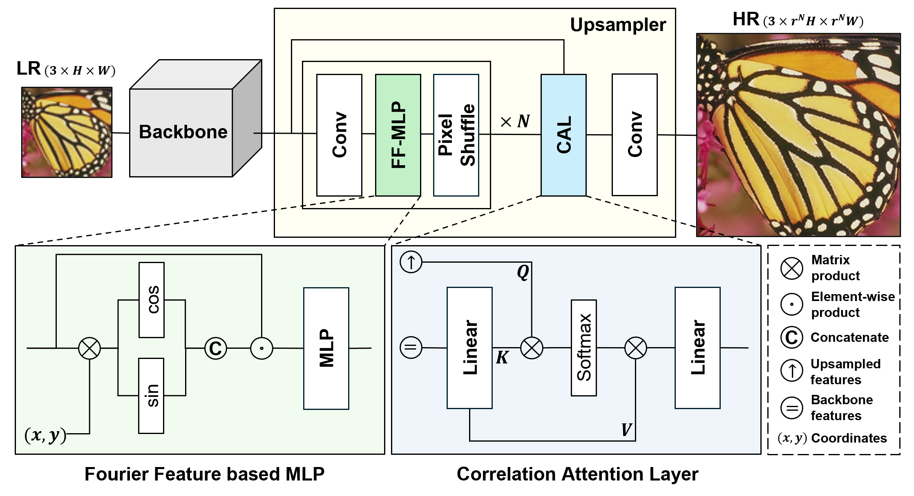

[](https://arxiv.org/abs/2508.10616)
[](https://hpc-lab-koreatech.github.io/FGA-SR/)
[](https://huggingface.co/choidj/FGA-SR)
[](https://github.com/HPC-Lab-KOREATECH/FGA-SR/pulls)
[](#license)

# FGA-SR: Fourier-Guided Attention Upsampling for Image Super-Resolution

**Official PyTorch implementation** of:

> **Fourier-Guided Attention Upsampling for Image Super-Resolution**  
> *Daejune Choi, Youchan No, Jinhyung Lee, Duksu Kim*  
> [[Paper]](https://arxiv.org/abs/2508.10616) [[Project Page]](https://hpc-lab-koreatech.github.io/FGA-SR/) [[Weights]](https://huggingface.co/choidj/FGA-SR)

---

## 🔎 Summary

We propose **Fourier-Guided Attention (FGA)**, a **drop-in upsampler** for single-image super-resolution. FGA adds only **~0.3M** parameters yet consistently improves PSNR (**+0.14dB** on lightweight backbones; **+0.12dB** on original-scale backbones) and substantially improves **frequency-domain fidelity** (e.g., **+26–29%** FRC-AUC on Urban100 across multiple backbones).  
FGA integrates:
- **Fourier-Feature MLP** for position-aware frequency encoding  
- **Correlation Attention Layer and Cross-Resolution Correlation Attention (CAL/XRA)** for feature alignment  
- **Frequency-Domain L1 Loss** for spectral consistency

> A **plug-and-play** replacement for **PixelShuffle**, **transposed convolution (deconvolution)**, and **nearest-neighbor upsampling + conv.**

---

## 🖼️ Overview

<p align="center">
  
</p>
<p align="center"><sub><b>Fig. 1.</b> Architecture overview.</sub></p>

<p align="center">
  
</p>
<p align="center"><sub><b>Fig. 2.</b> Spectra & feature maps.</sub></p>

### 🧩 What the figures show (brief)
- **FGA upsampler** plugs into any SR backbone. Inside: <i>Conv → Fourier-Feature MLP → PixelShuffle</i> (×N), then **CAL/XRA** for cross-resolution alignment, and a final <i>Conv</i> to RGB.
- The **Fourier-Feature MLP** injects frequency-aware positional cues (sin/cos encoding), guiding the upsampler to texture-dense regions.
- **CAL/XRA** computes correlations between upsampled features and backbone features to recover sharp details while suppressing artifacts.
- **Fig. 2** compares common upsamplers: FGA shows more **symmetric high-frequency energy** in FFT magnitude and **cleaner micro-patterns** in feature maps—fewer checkerboard/aliasing effects (backbone network is EDSR).

---

## 📌 Updates

* ✅ **2025-08-14**: arXiv v1 released.
* ✅ **2025-08-20**: Code release (this repository).
* ✅ **2025-08-20**: Model zoo & pretrained weights for ×4.
* ✅ **2025-08-20**: DTD235 dataset released.
* ✅ **2025-08-21**: Visual SR results.
* ✅ **2025-08-21**: Inference code.

---

## ✨ Features
- **Drop-in**: Replace common upsamplers with FGA
- **Backbone-agnostic**: Works with CNN/Transformer SR (EDSR/RCAN/HAN/NLSN/SwinIR-style)
- **Lightweight**: ~+0.3M parameters
- **Spectral-aware**: Less aliasing/ringing via frequency-domain supervision

---

## 📦 Installation

Install **PyTorch** first (choose the proper CUDA build from pytorch.org), then:

```bash
pip install -r requirements.txt
python setup.py develop
```

Or use the provided [Dockerfile](dockerfile).

---

## 🚀 Quick Start

### 📁 Dataset

- For data preparation, refer to:
  - **Training and testing datasets**
    - [Dataset Preparation (BasicSR)](https://github.com/XPixelGroup/BasicSR/blob/master/docs/DatasetPreparation.md)
  - **DTD235 testing dataset, a texture-focused test set randomly sampled from the [DTD dataset](https://www.robots.ox.ac.uk/~vgg/data/dtd).**
    - [](https://huggingface.co/datasets/choidj/FGA-SR)

### ▶️ Inference

Get pretrained weights for all supported backbones from [](https://huggingface.co/choidj/FGA-SR).

Download an **FGA×4** checkpoint (e.g., `EDSR-FGAx4.pth`, `EDSR-LW-FGAx4.pth`,...) and run:

```bash
# General format
python inference.py \
  --backbone [backbone] \
  --input_dir [input_dir] \
  --output_dir [output_dir] \
  --weight_path [weight_path]

# SwinIR example
python inference.py \
  --backbone SwinIR \
  --input_dir [input_dir] \
  --output_dir [output_dir] \
  --weight_path weights/SwinIR-FGAx4.pth
```
> **Important:** This inference script supports **FGA** upsamplers **only**.  
> ✅ `EDSR-LW-FGAx4.pth` (supported)  
> ❌ `EDSR-LWx4.pth` (not supported)  
> `--backbone`: one of `EDSR`, `EDSR-LW`, `RCAN`, `RCAN-LW`, `HAN`, `HAN-LW`, `SwinIR`, `SwinIR-LW`, `NLSN`, `NLSN-LW`  
> `--weight_path`: path to the downloaded checkpoint

### 🧪 Testing

- Refer our .yml file or make your .yml file in the [options/test](options/test) folder for testing and run:
```bash
# 1 GPU
python fga/test.py -opt options/test/EDSR/test_EDSR-FGAx4.yml
```
- Testing logs and outputs are saved in `results/`.
---

### 🏋️ Training

- Refer our .yml file or make your .yml file in the [options/train](options/train) folder for training and run:
```bash
# 1 GPU
python fga/train.py -opt options/train/EDSR/train_EDSR-FGAx4.yml

# DDP (multi-GPU)
torchrun --nproc_per_node=4 fga/train.py \
  -opt options/train/SwinIR/train_SwinIR-FGAx4.yml \
  --launcher pytorch
```
- Training logs, checkpoints, and samples are saved in `experiments/`.
---

## 🔩 Integrate FGA into Your Model
```python
import torch
import torch.nn as nn
from fga.archs.fga_arch import FGA

class MySRNet(nn.Module):
    def __init__(self, scale=4, feat_dim=192):
        super().__init__()
        self.body = MyBackbone(feat_dim)
        self.upsampler = FGA(
                 dim=64,
                 back_embed_dim=feat_dim,
                 out_dim=3,
                 upscale=scale,
        )

    def forward(self, x):
        f = self.body(x)
        f_up = self.upsampler(f)
        return f_up
```

---

## 📊 Results (×4, Lightweight-scale (µ) & Original-scale)

**SPC** : Sub-Pixel Convolution (**PixelShuffle**)  
**FGA** : Fourier-Guided Attention (**Ours**)  

**Backbones**: EDSR, RCAN, HAN, NLSN, SwinIR  
**Backbone scale**: Lightweight-scale (µ), Original-scale (origin)  

> <details>
> <summary><b>Parameters</b></summary>
> 
> | Setting        |  EDSR |  RCAN |  HAN  |  NLSN | SwinIR |
> | -------------- | :---: | :---: | :---: | :---: | :----: |
> | µ + SPC        |  1.5M |  4.3M |  8.6M |  1.6M |  1.2M  |
> | µ + FGA        |  1.8M |  4.6M |  8.9M |  1.9M |  1.5M  |
> | Original + SPC | 38.7M | 15.6M | 16.1M | 39.7M |  11.9M |
> | Original + FGA | 39.0M | 15.9M | 16.4M | 40.0M |  12.2M |
> 
> </details>

**Settings**: For each backbone, **top row = SPC** (baseline), **bottom row = FGA** (ours)

### 📈 PSNR
> 
> <details>
> <summary><b>Metric: PSNR (Set5 / Set14 / BSD100 / Urban100 / Manga109 / DTD235)</b></summary>
> 
> | Backbone (scale) | Upsampler | Set5      | Set14     | BSD100    | Urban100  | Manga109  | DTD235    |
> | :--------------- | :-------- | :-------- | :-------- | :-------- | :-------- | :-------- | :-------- |
> | EDSR-µ           | SPC       | 32.12     | 28.59     | 27.58     | 26.08     | 30.41     | 29.73     |
> |                  | **FGA**   | **32.30** | **28.68** | **27.64** | **26.27** | **30.74** | **29.80** |
> | EDSR-origin      | SPC       | 32.46     | 28.80     | 27.71     | 26.64     | 31.02     | **29.91** |
> |                  | **FGA**   | **32.50** | 28.80     | **27.74** | **26.67** | **31.05** | 29.89     |
> | RCAN-µ           | SPC       | 32.34     | 28.69     | 27.65     | 26.44     | 30.78     | 29.88     |
> |                  | **FGA**   | **32.43** | **28.76** | **27.70** | **26.52** | **30.94** | **29.90** |
> | RCAN-origin      | SPC       | 32.63     | 28.87     | 27.77     | 26.82     | 31.22     | 30.00     |
> |                  | **FGA**   | 32.63     | **28.88** | **27.79** | **26.83** | **31.23** | **30.02** |
> | HAN-µ            | SPC       | 32.44     | 28.76     | 27.70     | 26.55     | 30.96     | 29.92     |
> |                  | **FGA**   | **32.52** | **28.85** | **27.75** | **26.70** | **31.21** | **29.97** |
> | HAN-origin       | SPC       | 32.64     | 28.90     | 27.80     | 26.85     | 31.42     | 30.06     |
> |                  | **FGA**   | **32.68** | **28.93** | **27.81** | **26.91** | **31.43** | 30.06     |
> | NLSN-µ           | SPC       | 32.30     | 28.69     | 27.65     | 26.37     | 30.75     | 29.84     |
> |                  | **FGA**   | **32.48** | **28.81** | **27.73** | **26.64** | **31.17** | **29.96** |
> | NLSN-origin      | SPC       | 32.59     | 28.87     | 27.78     | 26.96     | 31.27     | 30.08     |
> |                  | **FGA**   | **32.72** | **28.98** | **27.85** | **27.09** | **31.59** | **30.11** |
> | SwinIR-µ         | SPC       | 32.49     | 28.86     | 27.75     | 26.66     | 31.23     | 29.96     |
> |                  | **FGA**   | **32.59** | **28.97** | **27.82** | **26.86** | **31.55** | **30.06** |
> | SwinIR-origin    | SPC       | 32.92     | 29.09     | 27.92     | 27.45     | 32.03     | 30.28     |
> |                  | **FGA**   | **32.96** | **29.13** | **27.96** | **27.47** | **32.14** | **30.29** |
> 
> </details>

### 🌀 FRC-AUC (Top-25% rings)

We additionally report **FRC-AUC (Top-25% frequency rings)** as frequency-domain fidelity; higher is better.

> 📓 **Details & code**: see **[`frc_demo.ipynb`](scripts/frc_demo.ipynb)** — it provides formulas, step-by-step computation, plotting FRC curves and High-Freq AUC.
> <details>
> <summary><b>Metric: FRC-AUC (Top-25% rings) (Set5 / Set14 / BSD100 / Urban100 / Manga109 / DTD235)</b></summary>
> 
> | Backbone      | Upsampler |    Set5    |    Set14   |   BSD100   |  Urban100  |  Manga109  |   DTD235   |
> | :------------ | :-------- | :--------: | :--------: | :--------: | :--------: | :--------: | :--------: |
> | EDSR-µ        | SPC       |   0.2648   |   0.2093   |   0.2126   |   0.2226   |   0.2998   |   0.1625   |
> |               | **FGA**   | **0.2941** | **0.2347** | **0.2294** | **0.2804** | **0.3313** | **0.1758** |
> | EDSR-origin   | SPC       |   0.2857   |   0.2281   |   0.2279   |   0.2809   |   0.3221   |   0.1745   |
> |               | **FGA**   | **0.2920** | **0.2358** | **0.2362** | **0.3010** | **0.3341** | **0.1771** |
> | RCAN-µ        | SPC       |   0.2740   |   0.2186   |   0.2199   |   0.2534   |   0.3216   |   0.1691   |
> |               | **FGA**   | **0.3020** | **0.2373** | **0.2339** | **0.2975** | **0.3323** | **0.1771** |
> | RCAN-origin   | SPC       |   0.2924   |   0.2367   |   0.2365   |   0.2962   |   0.3387   |   0.1788   |
> |               | **FGA**   | **0.2947** | **0.2433** | **0.2389** | **0.3097** | **0.3424** | **0.1795** |
> | HAN-µ         | SPC       |   0.2824   |   0.2289   |   0.2299   |   0.2799   |   0.3287   |   0.1735   |
> |               | **FGA**   | **0.3028** | **0.2406** | **0.2378** | **0.3119** | **0.3487** | **0.1796** |
> | HAN-origin    | SPC       |   0.2211   |   0.1815   |   0.1983   |   0.1810   |   0.3224   |   0.1564   |
> |               | **FGA**   | **0.2953** | **0.2397** | **0.2373** | **0.3070** | **0.3450** | **0.1776** |
> | NLSN-µ        | SPC       |   0.2657   |   0.2155   |   0.2144   |   0.2330   |   0.3142   |   0.1670   |
> |               | **FGA**   | **0.2963** | **0.2439** | **0.2366** | **0.3017** | **0.3439** | **0.1799** |
> | NLSN-origin   | SPC       |   0.2851   |   0.2354   |   0.2357   |   0.3019   |   0.3380   |   0.1769   |
> |               | **FGA**   | **0.2999** | **0.2440** | **0.2415** | **0.3178** | **0.3502** | **0.1820** |
> | SwinIR-µ      | SPC       |   0.2655   |   0.1902   |   0.2209   |   0.2446   |   0.3342   |   0.1641   |
> |               | **FGA**   | **0.2965** | **0.2286** | **0.2392** | **0.3080** | **0.3548** | **0.1740** |
> | SwinIR-origin | SPC       |   0.2955   |   0.2238   |   0.2470   |   0.3371   |   0.3616   |   0.1805   |
> |               | **FGA**   | **0.3028** | **0.2336** | **0.2492** | **0.3477** | **0.3715** | **0.1815** |
> 
> </details>


### 🖼️ Visual results (SR images and Top-25% ring images)
>
> #### Shortcuts for visual viewer
> ```
> ← , →: previous, next image
> shift + wheel: page zoom
> (z)oom mode (toggle)
> wheel: resize zoom area (in zoom mode)
> ```
>
> <details>
> <summary><b>Per‑backbone galleries</b></summary>
> 
> | Backbone          | Datasets (SPC ↔ FGA side‑by‑side)                                                                                                                                 |
> | :---------------- | :---------------------------------------------------------------------------------------------------------------------------------------------------------------- |
> | **EDSR‑µ**        | [Set5][EDSR-LW-Set5] · [Set14][EDSR-LW-Set14] · [BSD100][EDSR-LW-BSD100] · [Urban100][EDSR-LW-Urban100] · [Manga109][EDSR-LW-Manga109] · [DTD235][EDSR-LW-DTD235]             |
> | **EDSR‑origin**   | [Set5][EDSR-Set5] · [Set14][EDSR-Set14] · [BSD100][EDSR-BSD100] · [Urban100][EDSR-Urban100] · [Manga109][EDSR-Manga109] · [DTD235][EDSR-DTD235]             |
> | **RCAN‑µ**        | [Set5][RCAN-LW-Set5] · [Set14][RCAN-LW-Set14] · [BSD100][RCAN-LW-BSD100] · [Urban100][RCAN-LW-Urban100] · [Manga109][RCAN-LW-Manga109] · [DTD235][RCAN-LW-DTD235]             |
> | **RCAN‑origin**   | [Set5][RCAN-Set5] · [Set14][RCAN-Set14] · [BSD100][RCAN-BSD100] · [Urban100][RCAN-Urban100] · [Manga109][RCAN-Manga109] · [DTD235][RCAN-DTD235]             |
> | **HAN‑µ**         | [Set5][HAN-LW-Set5] · [Set14][HAN-LW-Set14] · [BSD100][HAN-LW-BSD100] · [Urban100][HAN-LW-Urban100] · [Manga109][HAN-LW-Manga109] · [DTD235][HAN-LW-DTD235]                   |
> | **HAN‑origin**    | [Set5][HAN-Set5] · [Set14][HAN-Set14] · [BSD100][HAN-BSD100] · [Urban100][HAN-Urban100] · [Manga109][HAN-Manga109] · [DTD235][HAN-DTD235]                   |
> | **NLSN‑µ**        | [Set5][NLSN-LW-Set5] · [Set14][NLSN-LW-Set14] · [BSD100][NLSN-LW-BSD100] · [Urban100][NLSN-LW-Urban100] · [Manga109][NLSN-LW-Manga109] · [DTD235][NLSN-LW-DTD235]             |
> | **NLSN‑origin**   | [Set5][NLSN-Set5] · [Set14][NLSN-Set14] · [BSD100][NLSN-BSD100] · [Urban100][NLSN-Urban100] · [Manga109][NLSN-Manga109] · [DTD235][NLSN-DTD235]             |
> | **SwinIR‑µ**      | [Set5][SwinIR-LW-Set5] · [Set14][SwinIR-LW-Set14] · [BSD100][SwinIR-LW-BSD100] · [Urban100][SwinIR-LW-Urban100] · [Manga109][SwinIR-LW-Manga109] · [DTD235][SwinIR-LW-DTD235] |
> | **SwinIR‑origin** | [Set5][SwinIR-Set5] · [Set14][SwinIR-Set14] · [BSD100][SwinIR-BSD100] · [Urban100][SwinIR-Urban100] · [Manga109][SwinIR-Manga109] · [DTD235][SwinIR-DTD235] |
> 
> </details>

---

## 🧰 Model Zoo
[](https://huggingface.co/choidj/FGA-SR)

> <details>
> <summary><b>Configs & weights</b></summary>
> 
> | Scale |    Backbone   | Upsampler |            Config            | Weights                      |
> | :---: | :-----------: | :-------: | :--------------------------: | :--------------------------- |
> |   ×4  |     EDSR-µ    |    SPC    |  [Config][EDSR-LW-SPC-config]  | [Weight][EDSR-LW-SPC-weight]   |
> |   ×4  |     EDSR-µ    |    FGA    |  [Config][EDSR-LW-FGA-config]  | [Weight][EDSR-LW-FGA-weight]   |
> |   ×4  |  EDSR-origin  |    FGA    |  [Config][EDSR-FGA-config]  | [Weight][EDSR-FGA-weight]   |
> |   ×4  |     RCAN-µ    |    SPC    |  [Config][RCAN-LW-SPC-config]  | [Weight][RCAN-LW-SPC-weight]   |
> |   ×4  |     RCAN-µ    |    FGA    |  [Config][RCAN-LW-FGA-config]  | [Weight][RCAN-LW-FGA-weight]   |
> |   ×4  |  RCAN-origin  |    FGA    |  [Config][RCAN-FGA-config]  | [Weight][RCAN-FGA-weight]   |
> |   ×4  |     HAN-µ     |    SPC    |   [Config][HAN-LW-SPC-config]  | [Weight][HAN-LW-SPC-weight]    |
> |   ×4  |     HAN-µ     |    FGA    |   [Config][HAN-LW-FGA-config]  | [Weight][HAN-LW-FGA-weight]    |
> |   ×4  |   HAN-origin  |    FGA    |   [Config][HAN-FGA-config]  | [Weight][HAN-FGA-weight]    |
> |   ×4  |     NLSN-µ    |    SPC    |  [Config][NLSN-LW-SPC-config]  | [Weight][NLSN-LW-SPC-weight]   |
> |   ×4  |     NLSN-µ    |    FGA    |  [Config][NLSN-LW-FGA-config]  | [Weight][NLSN-LW-FGA-weight]   |
> |   ×4  |  NLSN-origin  |    FGA    |  [Config][NLSN-FGA-config]  | [Weight][NLSN-FGA-weight]   |
> |   ×4  |    SwinIR-µ   |    SPC    | [Config][SwinIR-LW-SPC-config] | [Weight][SwinIR-LW-SPC-weight] |
> |   ×4  |    SwinIR-µ   |    FGA    | [Config][SwinIR-LW-FGA-config] | [Weight][SwinIR-LW-FGA-weight] |
> |   ×4  | SwinIR-origin |    FGA    | [Config][SwinIR-FGA-config] | [Weight][SwinIR-FGA-weight] |
> 
> </details>

---

## 📝 Citation

```bibtex
@article{Choi2025FGA,
  title   = {Fourier-Guided Attention Upsampling for Image Super-Resolution},
  author  = {Choi, Daejune and No, Youchan and Lee, Jinhyung and Kim, Duksu},
  journal = {arXiv preprint arXiv:2508.10616},
  year    = {2025}
}
```
---

## 🙏 Acknowledgements

We respectfully acknowledge the foundational role of [BasicSR](https://github.com/XPixelGroup/BasicSR) in this codebase. 
We are deeply grateful to the authors and contributors of these projects for their exceptional contributions.

---

## 📫 Contact

If you have any question, please email eowns02@gmail.com to discuss with the author.

<!-- Footnote link definitions: Visual galleries -->
[EDSR-LW-Set5]: https://hpc-lab-koreatech.github.io/FGA-SR/viewer/?config=edsr-lw.json&dataset=Set5
[EDSR-LW-Set14]: https://hpc-lab-koreatech.github.io/FGA-SR/viewer/?config=edsr-lw.json&dataset=Set14
[EDSR-LW-BSD100]: https://hpc-lab-koreatech.github.io/FGA-SR/viewer/?config=edsr-lw.json&dataset=BSD100
[EDSR-LW-Urban100]:https://hpc-lab-koreatech.github.io/FGA-SR/viewer/?config=edsr-lw.json&dataset=Urban100
[EDSR-LW-Manga109]:https://hpc-lab-koreatech.github.io/FGA-SR/viewer/?config=edsr-lw.json&dataset=Manga109
[EDSR-LW-DTD235]: https://hpc-lab-koreatech.github.io/FGA-SR/viewer/?config=edsr-lw.json&dataset=DTD235

[EDSR-Set5]: https://hpc-lab-koreatech.github.io/FGA-SR/viewer/?config=edsr.json&dataset=Set5
[EDSR-Set14]: https://hpc-lab-koreatech.github.io/FGA-SR/viewer/?config=edsr.json&dataset=Set14
[EDSR-BSD100]: https://hpc-lab-koreatech.github.io/FGA-SR/viewer/?config=edsr.json&dataset=BSD100
[EDSR-Urban100]:https://hpc-lab-koreatech.github.io/FGA-SR/viewer/?config=edsr.json&dataset=Urban100
[EDSR-Manga109]:https://hpc-lab-koreatech.github.io/FGA-SR/viewer/?config=edsr.json&dataset=Manga109
[EDSR-DTD235]: https://hpc-lab-koreatech.github.io/FGA-SR/viewer/?config=edsr.json&dataset=DTD235

[RCAN-LW-Set5]: https://hpc-lab-koreatech.github.io/FGA-SR/viewer/?config=rcan-lw.json&dataset=Set5
[RCAN-LW-Set14]: https://hpc-lab-koreatech.github.io/FGA-SR/viewer/?config=rcan-lw.json&dataset=Set14
[RCAN-LW-BSD100]: https://hpc-lab-koreatech.github.io/FGA-SR/viewer/?config=rcan-lw.json&dataset=BSD100
[RCAN-LW-Urban100]:https://hpc-lab-koreatech.github.io/FGA-SR/viewer/?config=rcan-lw.json&dataset=Urban100
[RCAN-LW-Manga109]:https://hpc-lab-koreatech.github.io/FGA-SR/viewer/?config=rcan-lw.json&dataset=Manga109
[RCAN-LW-DTD235]: https://hpc-lab-koreatech.github.io/FGA-SR/viewer/?config=rcan-lw.json&dataset=DTD235

[RCAN-Set5]: https://hpc-lab-koreatech.github.io/FGA-SR/viewer/?config=rcan.json&dataset=Set5
[RCAN-Set14]: https://hpc-lab-koreatech.github.io/FGA-SR/viewer/?config=rcan.json&dataset=Set14
[RCAN-BSD100]: https://hpc-lab-koreatech.github.io/FGA-SR/viewer/?config=rcan.json&dataset=BSD100
[RCAN-Urban100]:https://hpc-lab-koreatech.github.io/FGA-SR/viewer/?config=rcan.json&dataset=Urban100
[RCAN-Manga109]:https://hpc-lab-koreatech.github.io/FGA-SR/viewer/?config=rcan.json&dataset=Manga109
[RCAN-DTD235]: https://hpc-lab-koreatech.github.io/FGA-SR/viewer/?config=rcan.json&dataset=DTD235

[HAN-LW-Set5]: https://hpc-lab-koreatech.github.io/FGA-SR/viewer/?config=han-lw.json&dataset=Set5
[HAN-LW-Set14]: https://hpc-lab-koreatech.github.io/FGA-SR/viewer/?config=han-lw.json&dataset=Set14
[HAN-LW-BSD100]: https://hpc-lab-koreatech.github.io/FGA-SR/viewer/?config=han-lw.json&dataset=BSD100
[HAN-LW-Urban100]:https://hpc-lab-koreatech.github.io/FGA-SR/viewer/?config=han-lw.json&dataset=Urban100
[HAN-LW-Manga109]:https://hpc-lab-koreatech.github.io/FGA-SR/viewer/?config=han-lw.json&dataset=Manga109
[HAN-LW-DTD235]: https://hpc-lab-koreatech.github.io/FGA-SR/viewer/?config=han-lw.json&dataset=DTD235

[HAN-Set5]: https://hpc-lab-koreatech.github.io/FGA-SR/viewer/?config=han.json&dataset=Set5
[HAN-Set14]: https://hpc-lab-koreatech.github.io/FGA-SR/viewer/?config=han.json&dataset=Set14
[HAN-BSD100]: https://hpc-lab-koreatech.github.io/FGA-SR/viewer/?config=han.json&dataset=BSD100
[HAN-Urban100]:https://hpc-lab-koreatech.github.io/FGA-SR/viewer/?config=han.json&dataset=Urban100
[HAN-Manga109]:https://hpc-lab-koreatech.github.io/FGA-SR/viewer/?config=han.json&dataset=Manga109
[HAN-DTD235]: https://hpc-lab-koreatech.github.io/FGA-SR/viewer/?config=han.json&dataset=DTD235

[NLSN-LW-Set5]: https://hpc-lab-koreatech.github.io/FGA-SR/viewer/?config=nlsn-lw.json&dataset=Set5
[NLSN-LW-Set14]: https://hpc-lab-koreatech.github.io/FGA-SR/viewer/?config=nlsn-lw.json&dataset=Set14
[NLSN-LW-BSD100]: https://hpc-lab-koreatech.github.io/FGA-SR/viewer/?config=nlsn-lw.json&dataset=BSD100
[NLSN-LW-Urban100]:https://hpc-lab-koreatech.github.io/FGA-SR/viewer/?config=nlsn-lw.json&dataset=Urban100
[NLSN-LW-Manga109]:https://hpc-lab-koreatech.github.io/FGA-SR/viewer/?config=nlsn-lw.json&dataset=Manga109
[NLSN-LW-DTD235]: https://hpc-lab-koreatech.github.io/FGA-SR/viewer/?config=nlsn-lw.json&dataset=DTD235

[NLSN-Set5]: https://hpc-lab-koreatech.github.io/FGA-SR/viewer/?config=nlsn.json&dataset=Set5
[NLSN-Set14]: https://hpc-lab-koreatech.github.io/FGA-SR/viewer/?config=nlsn.json&dataset=Set14
[NLSN-BSD100]: https://hpc-lab-koreatech.github.io/FGA-SR/viewer/?config=nlsn.json&dataset=BSD100
[NLSN-Urban100]:https://hpc-lab-koreatech.github.io/FGA-SR/viewer/?config=nlsn.json&dataset=Urban100
[NLSN-Manga109]:https://hpc-lab-koreatech.github.io/FGA-SR/viewer/?config=nlsn.json&dataset=Manga109
[NLSN-DTD235]: https://hpc-lab-koreatech.github.io/FGA-SR/viewer/?config=nlsn.json&dataset=DTD235

[SwinIR-LW-Set5]: https://hpc-lab-koreatech.github.io/FGA-SR/viewer/?config=swinir-lw.json&dataset=Set5
[SwinIR-LW-Set14]: https://hpc-lab-koreatech.github.io/FGA-SR/viewer/?config=swinir-lw.json&dataset=Set14
[SwinIR-LW-BSD100]: https://hpc-lab-koreatech.github.io/FGA-SR/viewer/?config=swinir-lw.json&dataset=BSD100
[SwinIR-LW-Urban100]:https://hpc-lab-koreatech.github.io/FGA-SR/viewer/?config=swinir-lw.json&dataset=Urban100
[SwinIR-LW-Manga109]:https://hpc-lab-koreatech.github.io/FGA-SR/viewer/?config=swinir-lw.json&dataset=Manga109
[SwinIR-LW-DTD235]: https://hpc-lab-koreatech.github.io/FGA-SR/viewer/?config=swinir-lw.json&dataset=DTD235

[SwinIR-Set5]: https://hpc-lab-koreatech.github.io/FGA-SR/viewer/?config=swinir.json&dataset=Set5
[SwinIR-Set14]: https://hpc-lab-koreatech.github.io/FGA-SR/viewer/?config=swinir.json&dataset=Set14
[SwinIR-BSD100]: https://hpc-lab-koreatech.github.io/FGA-SR/viewer/?config=swinir.json&dataset=BSD100
[SwinIR-Urban100]:https://hpc-lab-koreatech.github.io/FGA-SR/viewer/?config=swinir.json&dataset=Urban100
[SwinIR-Manga109]:https://hpc-lab-koreatech.github.io/FGA-SR/viewer/?config=swinir.json&dataset=Manga109
[SwinIR-DTD235]: https://hpc-lab-koreatech.github.io/FGA-SR/viewer/?config=swinir.json&dataset=DTD235


<!-- Footnote link definitions: Model Zoo -->
[EDSR-LW-SPC-config]: options/train/EDSR/train_EDSR-LWx4.yml
[EDSR-LW-SPC-weight]: https://huggingface.co/choidj/FGA-SR/blob/main/FGA/EDSR/EDSR-LW-SPCx4.pth
[EDSR-LW-FGA-config]: options/train/EDSR/train_EDSR-LW-FGAx4.yml
[EDSR-LW-FGA-weight]: https://huggingface.co/choidj/FGA-SR/blob/main/FGA/EDSR/EDSR-LW-FGAx4.pth
[EDSR-FGA-config]: options/train/EDSR/train_EDSR-FGAx4.yml
[EDSR-FGA-weight]: https://huggingface.co/choidj/FGA-SR/blob/main/FGA/EDSR/EDSR-FGAx4.pth

[RCAN-LW-SPC-config]: options/train/RCAN/train_RCAN-LWx4.yml
[RCAN-LW-SPC-weight]: https://huggingface.co/choidj/FGA-SR/blob/main/FGA/RCAN/RCAN-LW-SPCx4.pth
[RCAN-LW-FGA-config]: options/train/RCAN/train_RCAN-LW-FGAx4.yml
[RCAN-LW-FGA-weight]: https://huggingface.co/choidj/FGA-SR/blob/main/FGA/RCAN/RCAN-LW-FGAx4.pth
[RCAN-FGA-config]: options/train/RCAN/train_RCAN-FGAx4.yml
[RCAN-FGA-weight]: https://huggingface.co/choidj/FGA-SR/blob/main/FGA/RCAN/RCAN-FGAx4.pth

[HAN-LW-SPC-config]: options/train/HAN/train_HAN-LWx4.yml
[HAN-LW-SPC-weight]: https://huggingface.co/choidj/FGA-SR/blob/main/FGA/HAN/HAN-LW-SPCx4.pth
[HAN-LW-FGA-config]: options/train/HAN/train_HAN-LW-FGAx4.yml
[HAN-LW-FGA-weight]: https://huggingface.co/choidj/FGA-SR/blob/main/FGA/HAN/HAN-LW-FGAx4.pth
[HAN-FGA-config]: options/train/HAN/train_HAN-FGAx4.yml
[HAN-FGA-weight]: https://huggingface.co/choidj/FGA-SR/blob/main/FGA/HAN/HAN-FGAx4.pth

[NLSN-LW-SPC-config]: options/train/NLSN/train_NLSN-LWx4.yml
[NLSN-LW-SPC-weight]: https://huggingface.co/choidj/FGA-SR/blob/main/FGA/NLSN/NLSN-LW-SPCx4.pth
[NLSN-LW-FGA-config]: options/train/NLSN/train_NLSN-LW-FGAx4.yml
[NLSN-LW-FGA-weight]: https://huggingface.co/choidj/FGA-SR/blob/main/FGA/NLSN/NLSN-LW-FGAx4.pth
[NLSN-FGA-config]: options/train/NLSN/train_NLSN-FGAx4.yml
[NLSN-FGA-weight]: https://huggingface.co/choidj/FGA-SR/blob/main/FGA/NLSN/NLSN-FGAx4.pth

[SwinIR-LW-SPC-config]: options/train/SwinIR/train_SwinIR-LWx4.yml
[SwinIR-LW-SPC-weight]: https://huggingface.co/choidj/FGA-SR/blob/main/FGA/SwinIR/SwinIR-LW-SPCx4.pth
[SwinIR-LW-FGA-config]: options/train/SwinIR/train_SwinIR-LW-FGAx4.yml
[SwinIR-LW-FGA-weight]: https://huggingface.co/choidj/FGA-SR/blob/main/FGA/SwinIR/SwinIR-LW-FGAx4.pth
[SwinIR-FGA-config]: options/train/SwinIR/train_SwinIR-FGAx4.yml
[SwinIR-FGA-weight]: https://huggingface.co/choidj/FGA-SR/blob/main/FGA/SwinIR/SwinIR-FGAx4.pth